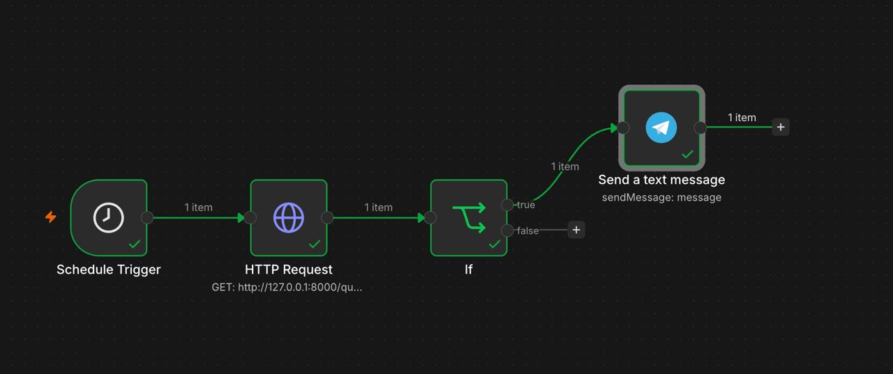

# Operations AI Copilot

Небольшой pet-проект про планирование запасов. Он отвечает на вопросы по продажам, остаткам и поставкам, а для сценария «что будет, если…» считает изменение запаса по дням. Данные специально лежат в трёх разных форматах: SQLite, CSV и JSON. 

## Как устроено

- `app/sources.py` читает продажи из `data/sales.db`, остатки из `data/inventory.csv` и поставки из `data/logistics.json`.
- `app/scenario.py` берёт средние продажи за последние 14 записей и строит дневной расчёт запаса. Изменение спроса и задержка поставок задаются параметрами. Модель предполагает постоянный спрос в течение сценария.
- `app/agent.py` даёт LLM инструменты для чтения данных и запуска расчёта. Числа считает Python, а агент выбирает нужный инструмент и объясняет результат.
- `app/main.py` открывает HTTP API через FastAPI.
- `app/quality.py` проверяет отрицательные остатки, наличие истории продаж для складских позиций и корректность записей о поставках.
- `n8n/workflow.json` содержит экспорт workflow: ежедневный запрос к `/quality`, проверку числа найденных проблем и сообщение в Telegram, если они есть. Nh обращений к агенту отправляются в Langfuse.



## Локальный запуск

Из корня проекта, в активированном Python-окружении с установленными зависимостями:

```bash
uvicorn app.main:app --reload
```

API будет доступно на `http://127.0.0.1:8000`, интерактивная документация — на `http://127.0.0.1:8000/docs`. Для обращения к `/ask` нужны настройки модели OpenRouter; для трассировки — учётные данные Langfuse.

Попробовать сценарий без LLM можно через `/docs` или запросом:

```bash
curl -X POST http://127.0.0.1:8000/scenario \
  -H 'Content-Type: application/json' \
  -d '{"product":"PE100","city":"Moscow","horizon_days":14,"demand_growth_pct":20,"shipment_delay_days":3}'
```

Для вопроса агенту отправьте `POST /ask` с JSON `{"question":"Что будет с запасами PE100 в Москве за 14 дней при росте спроса на 20% и задержке поставки на 3 дня?"}`.

## Проверка качества через n8n

Запустите n8n локально (`npx n8n`), импортируйте `n8n/workflow.json` и подключите свои Telegram credentials и Chat ID. Workflow обращается к `http://127.0.0.1:8000/quality`, поэтому n8n и FastAPI должны работать на одном компьютере. Если `issue_count > 0`, в Telegram уходит число проблем и их описание. При нуле проблем сообщение не отправляется.


